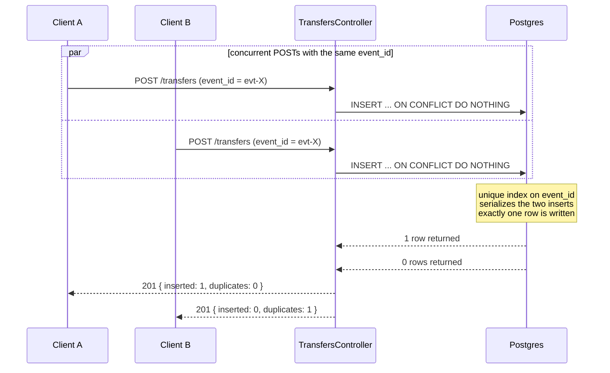

# Idempotent Events API

Ingests station transfer events with **idempotency** and **concurrency safety** as first-class guarantees.
Duplicate `event_id`s are dropped using a single `INSERT … ON CONFLICT DO NOTHING` — no read-before-write race,
no application-level locks, and the guarantee holds across multiple app instances.
A reconciliation endpoint returns per-station totals on demand.

> **Highlights:** partial-accept validation · per-event error detail · Scalar OpenAPI docs · graceful pool shutdown · integration tests

---

## Non-Goals

The following are intentionally **out of scope** for this take-home and called out so the surface area stays honest:

- **Cluster-wide rate limiting.** The throttler is per-instance — no Redis-backed counter, no API-gateway integration.
- **JWT / OAuth / RBAC.** Auth is API-key + Basic only; there is no user/role model.
- **Event mutation or correction.** Events are write-once via the primary key; there is no `PATCH /transfers/:id`.
- **Persistent audit trail of rejected events.** Validation failures are returned in the response, not stored.
- **Multi-tenancy.** Stations share a global namespace; there is no tenant isolation.

---

## Tech Stack

| Layer | Choice |
|---|---|
| Runtime | Node.js 20 |
| Framework | NestJS · TypeScript |
| Database | PostgreSQL 17 via Drizzle ORM |
| Auth | Basic Auth · `x-api-key` header |
| API Docs | Scalar (OpenAPI) at `/reference` |

**Requirements:** Node.js 20+ · PostgreSQL 16+ (or Docker)

---

## How It Works

### Idempotency

`event_id` is the primary key of `transfer_events`. Every insert goes through Drizzle's `.onConflictDoNothing()`,
which compiles to PostgreSQL's `INSERT … ON CONFLICT DO NOTHING`. Duplicates are silently skipped — never overwritten.

```sql
CREATE TABLE transfer_events (
  event_id   TEXT                     PRIMARY KEY,   -- idempotency primitive
  station_id TEXT                     NOT NULL,
  amount     NUMERIC(20, 4)           NOT NULL,      -- decimal-safe; no float drift
  status     TEXT                     NOT NULL,      -- only 'approved' counts toward totals
  created_at TIMESTAMP WITH TIME ZONE NOT NULL
);

CREATE INDEX transfer_events_station_status_idx
  ON transfer_events (station_id, status);           -- supports the summary query
```

This is preferred over a read-then-write check because it's a **single atomic round-trip** — no TOCTOU race
exists between the existence check and the insert. Idempotency and concurrency safety come from the same
primitive with no extra application logic.

`DO NOTHING` is deliberate over `ON CONFLICT DO UPDATE`: on a conflict PostgreSQL discards the incoming row
immediately after the index lookup — no heap write, no WAL entry, no new MVCC row version.
`DO UPDATE` would write a row version on every duplicate, generating WAL traffic and accumulating dead tuples
under high replay rates.

### Concurrency

Concurrency safety lives entirely at the database layer via the primary-key index. Two concurrent POSTs
carrying the same `event_id` race to insert — PostgreSQL's index serializes the conflict and exactly one
succeeds. No application-level locks, mutexes, or distributed coordination are needed. The guarantee is
correct across multiple app instances without any coordination overhead.



### Partial Accept

The batch follows a **validate-first, bulk-insert** pipeline:

1. Every event is validated individually by `class-validator` before any DB write.
2. Valid events are bulk-inserted in a single `INSERT … ON CONFLICT DO NOTHING`.
3. Invalid events are returned in `rejected[]` with their batch index and an error list.

This is chosen over **fail-fast** because it makes the endpoint safe to replay from message queues,
pub/sub systems, or any retry mechanism — a single malformed event in a replayed batch will never
block valid new events from being stored.

**Status codes:**

| Outcome | Status |
|---|---|
| At least one event was stored OR was a known duplicate | `201` with `{ inserted, duplicates, rejected }` |
| Every event failed validation (nothing written, no duplicates) | `400` with `{ inserted: 0, duplicates: 0, rejected: [...] }` |
| Request body shape itself is invalid (e.g. missing `events`, unknown top-level field) | `400` from the outer `ValidationPipe` |

**Validation rules per event:**

| Field | Rule |
|---|---|
| `event_id`, `station_id`, `status`, `created_at` | Required non-empty strings |
| `amount` | Required · non-negative number (`≥ 0`) |
| `created_at` | Valid ISO 8601 date string |
| `status` | Any string accepted · unknown values stored but excluded from `total_approved_amount` |
| Batch size | 1 – 1 000 events per request |

### `events_count` semantics

`events_count` reflects **all stored events** for the station regardless of status.
`total_approved_amount` sums only `status = 'approved'` events.
This gives a complete audit picture and lets callers derive the approval rate directly.

---

## Quick Start

**Docker — everything in one command:**

```bash
docker compose up --build
# API ready at http://localhost:3000
# OpenAPI docs at http://localhost:3000/reference
```

**Local:**

```bash
cp .env.example .env      # copy environment template
npm install               # install dependencies
npm run db:migrate        # apply migrations via drizzle-kit
make run                  # start dev server with watch mode
```

### Environment variables

| Variable | Description | Default |
|---|---|---|
| `DATABASE_URL` | PostgreSQL connection string | — |
| `API_KEY` | Expected value of the `x-api-key` header | — |
| `BASIC_AUTH_USER` | Basic auth username | `admin` |
| `BASIC_AUTH_PASS` | Basic auth password | `secret` |
| `PORT` | HTTP port | `3000` |

### Seed demo data

```bash
make seed           # local
make docker-seed    # Docker (runs in the builder stage — no production image impact)
```

Inserts 10 stations × 50 events each with randomised statuses (`approved` / `pending` / `rejected` / `unknown`).

---

## API

All API routes carry the prefix `/api/v1`. Auth and health routes are not versioned.

### Endpoints

| Method | Path | Auth | Description |
|---|---|---|---|
| `POST` | `/api/v1/transfers` | ✓ | Batch ingest transfer events |
| `GET` | `/api/v1/stations/:id/summary` | ✓ | Reconciliation summary per station |
| `GET` | `/health/live` | — | Liveness probe |
| `GET` | `/health/ready` | — | Readiness probe |
| `GET` | `/reference` | — | Scalar OpenAPI docs |

### POST /api/v1/transfers

#### Normal batch

```bash
curl -X POST http://localhost:3000/api/v1/transfers \
  -H "Content-Type: application/json" \
  -H "x-api-key: change-me-in-production" \
  -d '{
    "events": [
      {
        "event_id": "evt-001",
        "station_id": "station-42",
        "amount": 100.50,
        "status": "approved",
        "created_at": "2026-02-19T10:00:00Z"
      },
      {
        "event_id": "evt-002",
        "station_id": "station-42",
        "amount": 200.00,
        "status": "pending",
        "created_at": "2026-02-19T11:00:00Z"
      }
    ]
  }'
```

```json
{ "inserted": 2, "duplicates": 0, "rejected": [] }
```

#### Batch with one invalid event (partial accept)

```bash
curl -X POST http://localhost:3000/api/v1/transfers \
  -H "Content-Type: application/json" \
  -H "x-api-key: change-me-in-production" \
  -d '{
    "events": [
      {
        "event_id": "evt-003",
        "station_id": "station-42",
        "amount": 150.00,
        "status": "approved",
        "created_at": "2026-02-19T12:00:00Z"
      },
      {
        "event_id": "evt-bad",
        "station_id": "station-42",
        "amount": -50,
        "status": "approved",
        "created_at": "2026-02-19T12:01:00Z"
      }
    ]
  }'
```

```json
{
  "inserted": 1,
  "duplicates": 0,
  "rejected": [
    {
      "index": 1,
      "event_id": "evt-bad",
      "errors": ["amount must not be less than 0"]
    }
  ]
}
```

### GET /api/v1/stations/:station_id/summary

```bash
curl http://localhost:3000/api/v1/stations/station-42/summary \
  -H "x-api-key: change-me-in-production"
```

```json
{
  "station_id": "station-42",
  "total_approved_amount": 250.5,
  "events_count": 3
}
```

### Authentication

Both methods are accepted on all API routes:

```bash
# API key
curl -H "x-api-key: change-me-in-production" http://localhost:3000/api/v1/...

# Basic Auth
curl -u admin:secret http://localhost:3000/api/v1/...
```

### Health

```bash
curl http://localhost:3000/health/live    # 200 always
curl http://localhost:3000/health/ready   # 200 when DB reachable · 503 when down
```

---

## Tests

```bash
make test           # local — requires a running Postgres instance
make docker-test    # Docker — isolated test DB, no local Postgres needed
```

Integration tests cover:

- Batch insert returns correct `inserted` / `duplicates` counts
- Duplicate `event_id` is silently ignored — totals unchanged
- Out-of-order arrival produces the correct summary
- Concurrent POSTs with the same `event_id` never double-insert
- Partial accept: valid events are inserted despite invalid siblings in the batch
- Wholly-rejected batch returns `400` with the `rejected[]` payload
- Summary correctness per station (approved amount · event count)

---

## Failure Modes

Anticipated failures and the contract for each:

| Scenario | Behavior | Caller action |
|---|---|---|
| DB unreachable | `/health/ready` → 503 · API writes → 500 | Retry with backoff |
| Throttler tripped (> 100 req / min / instance) | 429 from `ThrottlerGuard` | Retry with exponential backoff |
| Bulk-insert error mid-batch | Transaction rolls back — nothing stored | Retry whole batch · `ON CONFLICT DO NOTHING` keeps it idempotent |
| Batch > 1 000 events or shape invalid | 400 from outer `ValidationPipe` | Split batch / fix shape |
| All events in a batch fail validation | 400 with the `rejected[]` payload | Fix the events client-side |
| Unknown `station_id` on summary | 404 | Verify the id; the station has never received an event |
| Missing or invalid credentials | 401 from `AuthGuard` | Provide `x-api-key` or Basic credentials |

---

## Tradeoffs & Production Path

| Concern | Current | Production path |
|---|---|---|
| Rate limiting | `@nestjs/throttler` · per-instance | API Gateway (Kong / AWS API GW) for cluster-wide limits |
| Dedup short-circuit | DB unique index | Redis `SET`-with-TTL populated *post-write* — on POST, look up `event_id` before the DB: hit → return `{duplicates: 1}` without a DB call; miss → normal DB path, then populate Redis on confirmed success. Never populate before confirmed write (would risk acking events that were never persisted). Helps only when replay-duplicate rate dominates ingest — measure first |
| Storage | Postgres · `EventStore` interface | Swap adapter without touching business logic |
| Auth | Basic Auth / API key | JWT + RBAC via an identity provider |
| Migrations | Run at app startup | Separate CI/CD step or init container in production |

---

## Project Structure

```
src/
  features/
    transfers/        # POST /transfers — controller, service, DTOs
    stations/         # GET /stations/:id/summary — controller, service, DTOs
  infrastructure/
    storage/          # EventStore port + PostgresEventStore adapter + Drizzle schema
    health/           # /health/live + /health/ready
  common/             # parseBasicAuth helper, shared auth guard
  config/             # env validation, app config
```

The `EventStore` interface (`src/infrastructure/storage/event-store.interface.ts`) is the persistence
contract. The Postgres adapter is the only one shipped — but "swappable" means the *port* is sufficient:
a new backend is a new class implementing `EventStore` plus one provider line in `StorageModule`. No
business logic changes. The integration tests pin the contract end-to-end so any future adapter must
preserve the same idempotency, concurrency, and reconciliation semantics.
